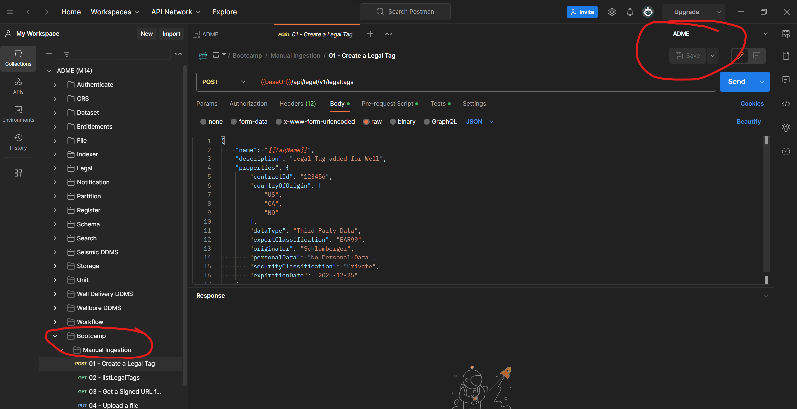
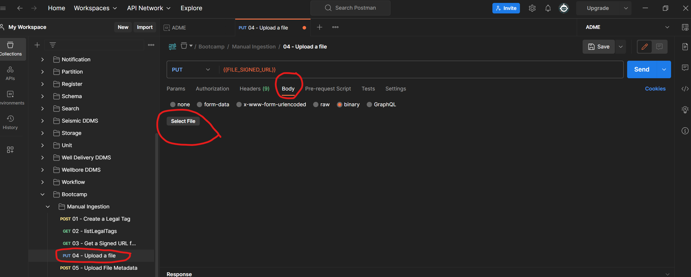

# Module 3 - Ingesting and reading data through Core APIs

In this module you will learn how to use the OSDU API to read and write data to the OSDU platform using:
- **File/Storage Service**: Manual ingestion
- **Workflow Service**: Manifest-based ingestion
- **CSV Parser**: Parsing CSV files through Workflow Service

## Prerequisites
Before beginning this tutorial, the following prerequisites must be completed:
- Download and install [Postman](https://www.postman.com/) desktop app (if not already done).
- We need to Import the sample Postman Collection & the Postman Environment files. 
- Then, we need to update the CURRENT_VALUE of the postman environment variables.
- Next step is to get the authentication token to be able to send the API calls from the imported postman collection.
- Follow the instructions at: [Postman Setup](../../Tools/Postman%20Collection/readme.md) untill #5 under *Authenticating* - *Interactive* - *User Token*

## 3.1 File/Storage Service: Manual ingestion
#### Objectives
- Ingest sample file into the Azure Data Manager for Energy Preview instance using Postman
- Retrieve/Download the ingested file using Postman
- Retrieve/Download the ingested file using OSDU CLI

This section uses the following API from the Postman Collection: `Bootcamp > Manual Ingestion`. All of the sample API calls are numbered and these need to be executed sequentially.

**NOTE:** Please ensure to choose the **ADME** Environment on the Top Right corner, before triggering the Postman Collection:

#### 3.1.1 Create a Legal Tag
Create a legal tag that will be added to the file metadata compliance purpose.
Navigate to the Postman Collection: `Bootcamp > Manual Ingestion > 01 - Create a Legal Tag` and click on **Send** button on the top right corner.

#### 3.1.2 List Legal Tags(Optional)
List out all the legal tags
Navigate to the Postman Collection: `Bootcamp > Manual Ingestion > 02 - listLegalTags` and click on **Send** button on the top right corner.

#### 3.1.3 Get a Signed URL for uploading a File
Get the signed URL path(in the staging area) to which the file will be uploaded
Navigate to the Postman Collection: `Bootcamp > Manual Ingestion > 03 - Get a Signed URL for uploading a file` and click on **Send** button on the top right corner.

#### 3.1.4 Upload a File
- Download the sample  to your local machine (you can choose any other filetype - CSV, LAS, JSON, etc.). 
- Navigate to the Postman Collection: `Bootcamp > Manual Ingestion > 04 - Upload a file` and click on **Send** button on the top right corner.
- Select this file in Postman by clicking the Select File option as shown in the Screenshot below

#### 3.1.5 Upload File Metadata
Upload the file metadata information such as file location & other relevant fields.
Navigate to the Postman Collection: `Bootcamp > Manual Ingestion > 05 - Upload File Metadata` and click on **Send** button on the top right corner.

#### 3.1.6 Get the File Metadata
Call to validate if the metadata got created successfully
Navigate to the Postman Collection: `Bootcamp > Manual Ingestion > 06 - Get the File Metadata` and click on **Send** button on the top right corner.

#### 3.1.7 Get All Records (Optional)
List out the records for the kind `osdu:wks:dataset--File.Generic:1.0.0`
Navigate to the Postman Collection: `Bootcamp > Manual Ingestion > 07 - getAllRecords` and click on **Send** button on the top right corner.

#### 3.1.8 Download the ingested File
Get a Download URL (from the persistent storage area). Copy the url and paste it in the Browser to download the file.
Navigate to the Postman Collection: `Bootcamp > Manual Ingestion > 08 - downloadURL` and click on **Send** button on the top right corner.

## Workflow Service: Manifest-based ingestion
#### Objectives
- Ingest sample manifests into the Azure Data Manager for Energy Preview instance using Postman
- Search for storage metadata records created during the manifest ingestion using Postman

This section uses the following API from the Postman Collection: `Bootcamp > Manifest Ingestion`. All of the sample API calls are numbered and these need to be executed sequentially.

## CSV Parser: Parsing CSV files through Workflow Service
#### Objectives
- Ingest a sample wellbore data CSV file into the Azure Data Manager for Energy Preview instance using Postman
- Search for storage metadata records created during the CSV Ingestion using Postman

This section uses the following API from the Postman Collection: `Bootcamp > CSV Parser Ingestion`. All of the sample API calls are numbered and these need to be executed sequentially.

## Congratulations! You have now completed the lab!
Continue with the next module: [Module 4 - Constructing Searches](../Module%204%20-%20Constructing%20Searches/readme.md)