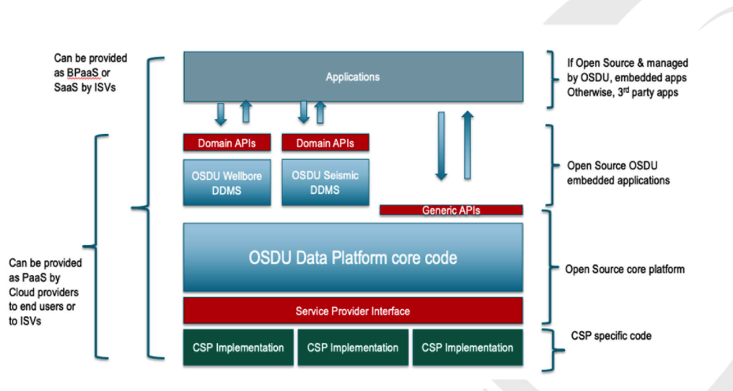
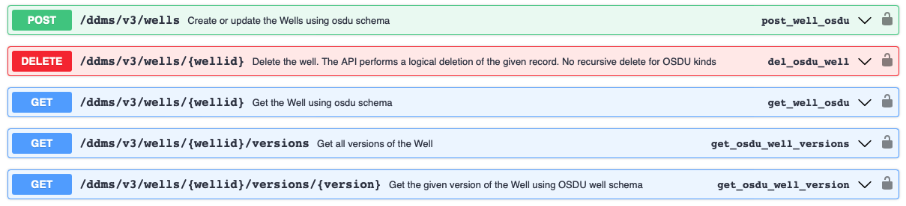
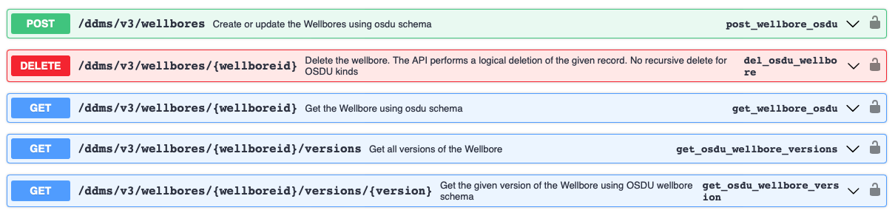
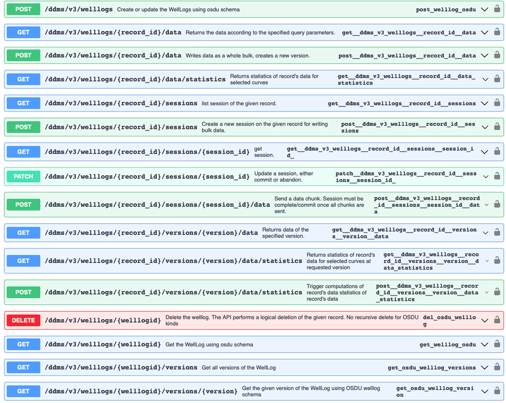
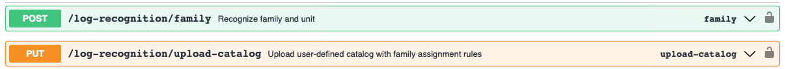

# Module 5 - Working with the Wellbore DDMS

In this module you will learn how to use the OSDU API to create wellbore/well log record and ingest well log data using the **Wellbore DDMS Service**.

## Objectives
- Create wellbore record
- Create well log record
- Ingest well log data into well log record.

## 5.1 Introduction

Wellbore Domain Data Management Services (Wellbore-DDMS) Open Subsurface Data Universe (OSDU) is one of the several backend services that comprise OSDU software ecosystem.

A service that persists data of specfic domain and provide access through optimized domain APIs. Governed by the platform but developed and evolved independently.

DDMS features:
- Leverage the core services
- Adhere to the usage patterns and common behavior
- Provide highly optimized storage & access for bulk data, with highly opinionated API's delivering the data required to enable domain workflows.

## 5.2 Wellbore DDMS endpoints
Following endpoints provided:

- Well:

- Wellbore:

- WellLog:

- Log recognition:

