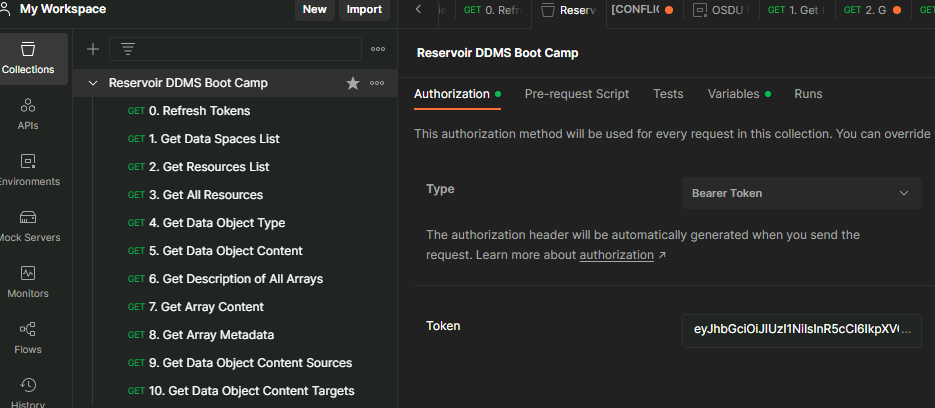

# Module 8 - Working with the Reservoir DDMS

In this lab you will explore fundamental capabilities and characteristics of the Reservoir DDMS. 

## Reservoir DDMS REST API - exploring the API and consume data 

Load the [postman collection](https://github.com/EirikHaughom/OSDUBootcamp/edit/main/Labs/Module%208%20-%20Working%20with%20the%20Reservoir%20DDMS/readme.md). 

1. 'Refresh Token' to fetch a az bearer token, and set it as auth token for the collection 
2. List the dataspaces. Currently there is one. 

Explore hierarchical object relationships for a seismic interpretation surface grid:
1. Feature
2. Interpretation
3. Representation
4. Properties

Use UUID's to reference objects in RDDMS and externally

## Use openETP client to ingest a RESQML epc file container with various Volve model data

## Discover and retrieve data loaded in the Reservoir DDMS using REST API

- use postman
- use jupyter notebook

