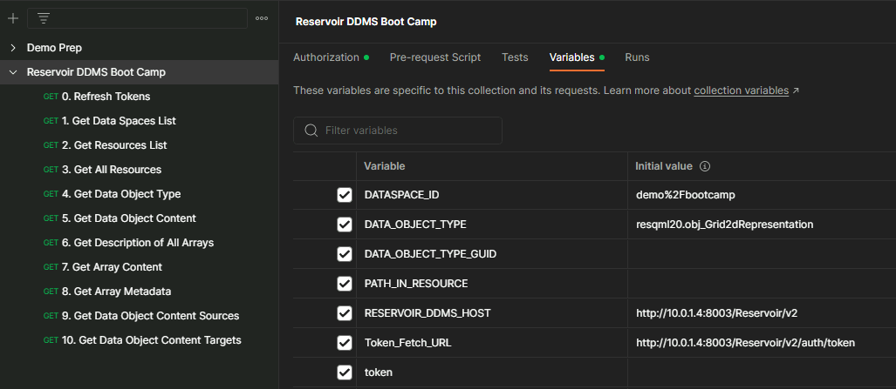

# Module 8 - Working with the Reservoir DDMS

In this lab you will explore fundamental capabilities and characteristics of the Reservoir DDMS. 

## Reservoir DDMS REST API - exploring the API and consume data 
### Discover and retrieve data loaded in the Reservoir DDMS using REST API: postman 

Load the [postman collection](RDDMS_postman_collection.json). Set the REST server address.

0. `Refresh Token` to fetch az bearer token
1. `Get Data Spaces List`. Currently there is one. 
2. `Get Resources List` List all resources contained in a data space. In our example, we have a Grid2d regular surface represetation of a HorizonInterpretation of a GeneticBoundary Feature, a CRS definition and a reference to the grid data array.
3. `Get All Resources` What is the name of the Feature, and what does the Grid2d represent? 
4. `Get Object Type` Get the objects of a certain type.
5. `Get Data Object Content` Get the actual content - either in json or xml format. Note that this part contains the meta data and object relataionships.
6. `Get Description of all Arrays` What is the reference and format to the geoemtry and/or property arrays.
7. `Get Array Content` Here we get the actual geoemtry and/or property arrays.
8. `Get Array Meta Data` Array dimensions etc.

Explore hierarchical object relationships for a seismic interpretation surface grid:
1. Feature
2. Interpretation
3. Representation
4. Properties

Use UUID's to reference objects in RDDMS and externally

### Discover and retrieve data loaded in the Reservoir DDMS using REST API: jupyter notebook

Launch the [jupyter notebook](RDDMS_2dgrid.ipynb). 

## Use openETP client to ingest a RESQML epc file container with various Volve model data

