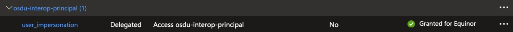

# Setup of infrastructure and data

The following steps should be performed to enable an infrastructure with sufficient data to enable the running of the lab-modules.

## Create app registration for ADME

If not already available an App Registration needs to be created in AAD of the tenant where the ADME will be deployed. This will be used for being the host of the ADME instance. Take caution that this will also grant this AppReg full access to **everything** within the ADME. As such it should be used with caution or only for setting up the instance.

TODO: do we need base redirect URIs for this?

## Create app registration for platform use (Optional) 

_Depending on the setup and focus for the bootcamp being run you can skip this step._

To enable a security segregation it would be advisable to not use the ADME app registration as this is a super user on the platform. This would mean that we would either want a separate machine user (App Reg) to perform the actions and/or we would like an actual user to do those actions. In both of these scenarios we need a separate AppReg (a single one can be used for both things).

If you want to enable this for user delegation then you need to set up API Permissions on this app-reg in AAD. Add ```user-impersonation``` for the ADME app-reg. Depending on your AAD setup this might require Global Admin approval. (see below image)



TODO: do we need base redirect URIs for this?

## Deploy ADME

Setup a fresh ADME instance using click-ops in the Azure Portal or use infrastructure-as-code scripts to facilitate this (e.g. bicep or ARM templates). Or re-use an existing ADME instance and create a separate data partition.

### Base configuration

When a fresh ADME or data partition has been completed it will consist of only the schemas based on the milestone currently supported, e.g. M14. Also the only user that has access to this instance is the app-reg used to create it.

After initial setup, only the installation app registration has access to OSDU and this needs to be used to register an initial admin user. Afterwards all further administration can / should be done with user accounts and not the app registration.

First create a temporary client secret in the ADME app-reg.

_To do the next step you will need to have the [REST Client](https://marketplace.visualstudio.com/items?itemName=humao.rest-client) in Visual Studio code installed and configured._

Open [entitlements-set-initial-admin.http](entitlements-set-initial-admin.http) in Visual Studio Code and use Ctrl+Alt+E to select the correct environment. Send each of the requests in turn by clicking on the _Send Request_ button for each http command. This will setup the given user as OWNER on several groups giving them access to add other users. They should now be able to connect using the OSDU CLI (see below) using interactive login and so all further setup can / should then be performed using normal accounts.

Important: After setting a initial admin the client secret should be deleted from the app registration for security purposes as future connections should be done by other means.

### Setup OSDU CLI

The [OSDU CLI](https://community.opengroup.org/osdu/platform/data-flow/data-loading/osdu-cli) is used for the following setup so should be installed and set up to target the correct environment. Environment configurations can be found [here](../Labs/Module%201%20-%20Authentication%20and%20authorization/config). Copy this file to the .osducli folder in your home directory and then use the below command to seclect the correct one to use:
```
osdu config default 
```

### Add more users to the OSDU instance

From the scripts folder run [entitlements-add-admin-users.azcli](/Setup/entitlements-add-admin-users.azcli) (note - requires bash) to add users to new groups as necessary. Note: you will need to manually update the DATA_PARTITION name in the script based upon the environment you are targeting.
```
entitlements-add-admin-users.azcli <path to config> <data-partition-name>
```

### Add legal tags

Before we can import the reference data we need to refer to an existing legal tag. So let us create one for this purpose. Run the following OSDU CLI command to use the provided legal tag (ensure you have the correct path):
```
osdu legal add -p Setup/legal-tags/bootcamp-osdu-reference-default.json 
```

### Add Standard Reference data

Next we load the OSDU official reference data. First download the repo with the specific version you want to ingest, e.g. 0.17 (aka M14) and then use the OSDU CLI to upload the relevant manifest files. In the below example script replace the DATA_PARTITION_NAME accordingly. If using a different release of the reference data then create / use a different version of the ingestion sequence as appropriate.

    mkdir tmp
    cd tmp
    
    DATA_PARTITION_NAME=<your data partition>
    DOMAIN=dataservices.energy
    ACLO=data.default.owners@$DATA_PARTITION_NAME.$DOMAIN
    ACLV=data.default.viewers@$DATA_PARTITION_NAME.$DOMAIN
    TAG_NAME="v0.17.0" # tag name for the release 0.17.0 (seems like they use tags rather than branch...)
    git clone -b $TAG_NAME --single-branch https://community.opengroup.org/osdu/data/data-definitions.git
    
    cd data-definitions/ReferenceValues
    
    osdu dataload ingest -p "Manifests/reference-data/IngestionSequence.json" -l $DATA_PARTITION_NAME-bootcamp-osdu-reference-default -aclo $ACLO -aclv $ACLV -b 100 -s

**Note: you might need to run the ingestion several times (3-5 times?). Your end point clue is that there are no new workloads started, then you know that all data has been ingested. The list of workload ids supplied at the end of the run should become shorter every time you run it.**

### Add TNO data

TODO - Eirik :) 


Prepare lab list:
- Create App Registration
- Deploy ADME
- Base configuration
    - Redirect URIs (Postman, Power BI(?), localhost?)
